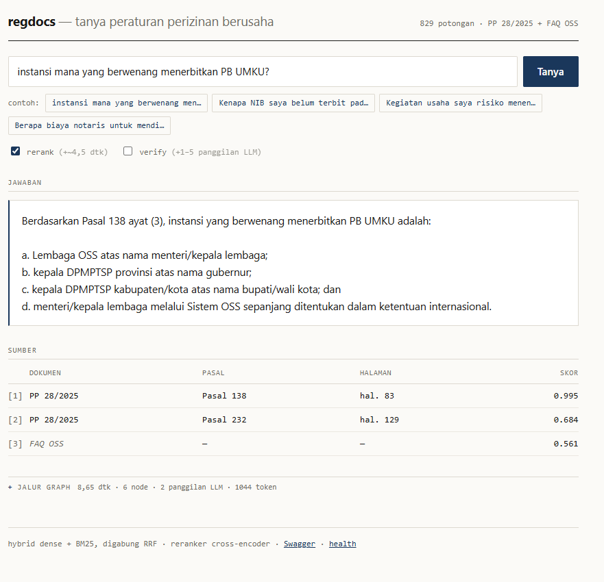
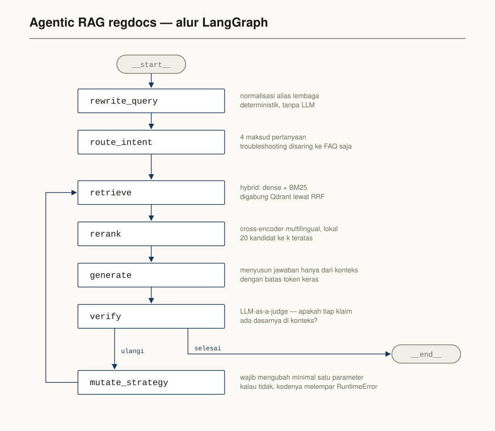

# Catatan Teknis

> Versi panjang dari [`README.md`](../README.md): angka lengkap,
> bukti, dan alasan di balik tiap keputusan.

Sistem tanya-jawab atas peraturan perizinan berusaha berbasis risiko, dengan
**sitasi tingkat pasal yang bisa diverifikasi** dan **evaluasi retrieval yang
terukur di setiap perubahan**.

> Dibangun bertahap dalam 13 tahap. Tiap tahap punya kriteria selesai sendiri,
> dan tiap perubahan retrieval diukur sebelum-sesudah di
> [`experiments.md`](experiments.md).



Buka PDF-nya di halaman 83, pasalnya ada di sana. Itu intinya.

Lama tiap node ikut di setiap jawaban, terlipat di bawah sumber. Bukan hiasan:
angka itu yang jadi bahan tabel benchmark di bawah.

---

## Angka

Semua diukur lokal atas 30 pertanyaan golden, korpus 829 chunk.

### Mutu retrieval

| Metrik | `regulasi` (23 soal) | `faq` (3 soal) |
|---|---|---|
| recall@5 | **0,580** | 1,000 |
| recall@10 | 0,725 | 1,000 |
| MRR | 0,526 | 0,667 |
| nDCG@10 | 0,552 | 0,754 |

Angka `faq` **optimistis** dan sengaja dilaporkan terpisah: pertanyaannya
parafrase dari entri yang ada di dalam korpus. Menggabungkannya ke satu angka
akan menutupi mutu sebenarnya di sisi regulasi.

### Benchmark verify on/off

| | verify OFF | verify ON |
|---|---|---|
| latensi p50 | **8.581 ms** | 10.794 ms |
| latensi p95 | 13.923 ms | **27.203 ms** |
| panggilan LLM / pertanyaan | 2,0 | 2,97 |
| token / pertanyaan | 1.257 | 2.881 |
| biaya USD / 1.000 pertanyaan | **0,434** | **0,927** |
| faithfulness | — | **0,852** |
| pertanyaan di luar korpus dijawab "tidak tahu" | **4/4** | **4/4** |

Verifikasi menaikkan p50 sebesar 26%, tapi **p95 sebesar 95%** — percobaan
ulang jatuh pada pertanyaan yang memang sulit, dan ekor distribusinya yang
terpukul. Biaya dihitung dengan harga tier berbayar `gemini-3.1-flash-lite`;
proyek ini sendiri jalan di tier gratis.

Yang paling tidak disangka: **sistem menolak pertanyaan di luar korpus tanpa
perlu verifikasi.** Yang ditambahkan verifikasi adalah `verdict` yang bisa
dibaca mesin, bukan penolakan yang lebih baik.

### Akurasi routing dan kalibrasi verifier

| | angka | catatan |
|---|---|---|
| akurasi routing | **70,0%** (35/50) | diukur pada label perak, lihat batasannya |
| kalibrasi verifier | **92,3%** (24/26) | dua kali jalan: 92,3% dan 96,2%; selisihnya murni gagal rate limit |

---

## Menjalankan

```bash
docker compose up -d      # Qdrant + API + dashboard
make ingest               # regulasi + FAQ -> Qdrant
```

Dashboard-nya langsung hidup di <http://localhost:8000>, Swagger di
<http://localhost:8000/docs>.

Dashboard itu satu berkas HTML statis yang di-mount di FastAPI yang sama. Tanpa
npm, tanpa build, tanpa proses tambahan. Dua kotak centang di atas membuka
pertukaran yang biasanya disembunyikan: `rerank` menaikkan recall@10 sebesar
0,117 dengan ongkos ~4,5 detik, `verify` melipatgandakan biaya per pertanyaan.

```bash
curl -X POST http://localhost:8000/api/v1/query \
  -H "Content-Type: application/json" \
  -d '{"question":"instansi mana yang berwenang menerbitkan PB UMKU"}'
```

| Endpoint | Isi |
|---|---|
| `POST /api/v1/query` | `answer`, `citations`, `intent`, `verdict`, `trace`, `token`, `degraded_mode` |
| `GET /health` | status Qdrant, jumlah titik, sisa budget LLM |
| `GET /documents` | sumber yang ada di korpus |
| `GET /` | dashboard |

Ada juga CLI: `make chat`.

**Jaringan antar container:** API memanggil Qdrant lewat nama service
(`http://qdrant:6333`), bukan `localhost` — di dalam container, `localhost`
berarti container itu sendiri.

---

## Cara kerja



Bentuk di atas diambil dari graph yang dikompilasi, bukan digambar tangan:
`bangun().get_graph().draw_mermaid()`.

| Langkah | Isi |
|---|---|
| `rewrite_query` | normalisasi alias lembaga, deterministik tanpa LLM |
| `route_intent` | 4 maksud; `troubleshooting` disaring ke FAQ saja |
| `retrieve` | hybrid: dense + BM25, digabung Qdrant lewat RRF |
| `rerank` | cross-encoder multilingual, 20 kandidat → k teratas |
| `generate` | Gemini, hanya dari konteks, dengan batas token keras |
| `verify` | opsional; kalau tidak didukung, ulangi dengan parameter **wajib berbeda** |

**Korpus** 829 chunk dalam satu collection, dibedakan lewat `source_type`:
PP 28/2025 (503 chunk, dipotong per pasal) dan 6 file FAQ OSS (326 chunk).

**Model:** embedding `nvidia/nemotron-3-embed-1b:free` lewat OpenRouter
(2.048 dimensi, prefix `query:`/`document:`), sparse BM25 lewat fastembed,
reranker `jina-reranker-v2-base-multilingual`, LLM `gemini-3.1-flash-lite`.
Dua yang di tengah jalan di komputer sendiri, tanpa API.

---

## Tahan banting

Sistem tetap menjawab saat layanan luar mati — `degraded_mode: true` dengan
alasan yang disebutkan, bukan error 500.

| Yang mati | Yang tetap jalan |
|---|---|
| Embedding (OpenRouter) | BM25 + reranker lokal, pasal tetap keluar |
| Routing (Gemini) | seluruh korpus tetap dicari, filter dibuang bukan ditebak |
| Penyusun jawaban (Gemini) | sitasi dan kutipan mentah tetap dikembalikan |

Dibuktikan dengan mengosongkan **kedua** API key lalu membuat ulang container:
jawabannya `HTTP 200`, dan Pasal 227 — jawaban yang memang benar — tetap
muncul di peringkat satu tanpa embedding sama sekali.

Tidak dengan simulasi saja: selama benchmark 60 permintaan, kuota Gemini
beberapa kali menolak di tengah jalan. **Tidak satu pun permintaan gagal.**

Pagar lain: rate limit 10 permintaan/menit per IP, budget LLM harian
(`BUDGET_LLM_HARIAN`, sisa terlihat di `/health`), dan `max_output_tokens`.

---

## Gerbang mutu di CI

Setiap PR menjalankan evaluasi retrieval dan **diblokir kalau ada metrik turun
lebih dari 5%** dari `eval/baseline_ci.json`.

Gate ini jalan **tanpa API key dan tanpa kuota sama sekali**: korpus dibekukan
ke `eval/korpus_fixture.jsonl` (829 chunk, 1,8 MB, teks saja) dan pencariannya
sparse-only — BM25 dihitung di runner, deterministik, gratis.

Terbukti merah saat retrieval sengaja dirusak: recall@5 0,550 → 0,450, exit
code 1, lengkap dengan instruksi cara memperbarui baseline kalau penurunannya
memang disengaja.

```bash
make fixture      # bekukan ulang korpus setelah pemotongan berubah
make eval-gate    # jalankan gate secara lokal
```

---

## Pemantauan

Lama tiap node ikut di respons API, dan dikirim ke
[Langfuse](https://cloud.langfuse.com) kalau key-nya diisi.

```
tanya-regdocs         AGENT       10.34s   intent, verdict, retry_count
  rewrite_query       SPAN         0.00s   in: query          out: rewritten, alias
  route_intent        CHAIN        1.36s   in: query          out: intent, source_type
    klasifikasi-intent  GENERATION 1.33s   model + token
  retrieve            RETRIEVER    0.18s   in: query, filter  out: chunk_ids
  rerank              TOOL         5.21s   in: jumlah         out: chunk_ids
  generate            CHAIN        1.90s   in: chunk_ids      out: answer
    susun-jawaban       GENERATION 1.87s   model + token
  verify              EVALUATOR    1.68s   in: answer         out: verdict, klaim
    nilai-jawaban       GENERATION 1.65s   model + token
```

```bash
make langfuse   # cek nilai .env, uji key, kirim trace percobaan
```

Tanpa key, modul pemantauan diam total dan angka latensi tetap ada di respons.

---

## Perintah

| Perintah | Isi |
|---|---|
| `docker compose up -d` | Qdrant + API + dashboard di `localhost:8000` |
| `make ingest` | regulasi + FAQ ke Qdrant |
| `make chat` | tanya-jawab CLI |
| `make api` | jalankan API lokal dengan reload |
| `make eval` | metrik retrieval |
| `make eval-routing` | akurasi `route_intent` di 50 item holdout |
| `make eval-gate` | gerbang CI secara lokal |
| `make fixture` | bekukan ulang korpus untuk CI |
| `make langfuse` | cek sambungan pemantauan |
| `make lint` / `make test` | ruff + mypy / pytest |

Benchmark dan kalibrasi:

```bash
uv run python -m scripts.benchmark
uv run python -m scripts.kalibrasi_verifier --batas 15
```

---

## Batasan korpus yang disadari

- **Nama berkas PDF-nya menyesatkan dan sempat menyesatkan proyek ini.**
  Berkas bernama `UU 28 2025 - ...pdf`, tetapi halaman judulnya berbunyi
  *Peraturan Pemerintah Nomor 28 Tahun 2025* — di dalamnya "Peraturan
  Pemerintah ini" muncul 42 kali, "Undang-Undang ini" nol kali. Sampai Tahap 5
  seluruh sitasi tertulis `UU 28/2025` dan itu salah. Identitas sekarang
  diambil dari halaman judul, bukan nama berkas. Berkasnya sengaja tidak
  diganti nama supaya jejak kesalahannya tetap terlihat.
- **Lapisan teks PDF salah membaca huruf** — 0 terbaca O, 1 terbaca l/I/L.
  144 dari 1.125 penanda pasal harus dibetulkan lewat daftar samaran.
- **Ke-97 item FAQ "Layanan Informasi" sengaja dipertahankan** meski nilainya
  rendah. Mereka pengecoh; korpus tanpa pengecoh membuat recall@5 terlihat
  bagus semata-mata karena tidak ada saingan.
- **Jawaban FAQ teknis cepat basi** — banyak yang menyebut elemen antarmuka
  ("klik ikon keranjang sampah"). Tanggal akses ikut disimpan di payload.

Daftar lengkap keputusan yang sengaja tidak dibangun, beserta alasannya, ada
di **[`batasan.md`](batasan.md)**.

---

## Sumber data

- **PP 28/2025** tentang Penyelenggaraan Perizinan Berusaha Berbasis Risiko,
  dari <https://jdih.bkpm.go.id>. Status `berlaku`; peraturan ini menggantikan
  PP 5/2021.
- **FAQ OSS BKPM**, dari <https://oss.go.id>, `last_updated` 2025-12-22 s.d.
  2025-12-24.

Peraturan perundang-undangan dikecualikan dari hak cipta berdasarkan UU
28/2014 tentang Hak Cipta Pasal 42. FAQ diambil dari halaman publik; sumber
dan tanggal aksesnya disimpan di payload tiap chunk dan ikut tercetak di
sitasi.

---

## Catatan

Ini proyek belajar. Yang dikejar bukan angka setinggi mungkin, melainkan
**angka yang bisa dipertanggungjawabkan** — lengkap dengan sebab kenapa dia
segitu, dan pengakuan di mana dia menyesatkan. Sebagian besar temuan paling
berguna di `docs/experiments.md` adalah kesalahan yang tertangkap, bukan
kemenangan.
